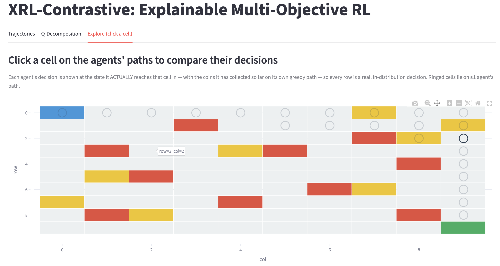
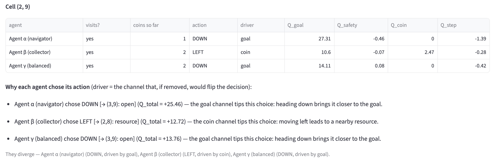

# XRL-Contrastive: Explaining Multi-Objective RL Agents

Three multi-objective deep-RL agents that differ along a **navigation-vs-collection**
priority, explained and contrasted with **per-channel reward decomposition**,
**contrastive explanations**, and **TCAV** concept attribution. Built on a
4-channel GridWorld extended from COMP9414 Assignment 2.

## Headline results

- **All three agents reach the goal (100% success)** — achieved only after
  diagnosing and fixing an overestimation-driven training collapse (the *deadly
  triad*).
- **They are genuinely distinct in behaviour:** the navigator goes straight (18
  steps, 1 incidental coin), the collector **detours** (20 steps) to grab 3
  coins, the balanced agent sits in between.
- **Key XAI finding — personality lives in the weights.** Explanations that
  include the scalarisation weights (reward decomposition, total-Q TCAV) recover
  each agent's character; a weight-agnostic *per-channel* TCAV does not, because
  the per-channel Q-values are shared (identical reward signals).
- **Explanations name the *decisive* channel** (leave-one-out): a coin detour is
  attributed to the coin channel — the one whose removal would flip the choice —
  not merely the largest-magnitude channel.

## 📊 The report

**[`report.ipynb`](report.ipynb)** is the full report — it renders directly on
GitHub with all figures and analysis. Start there.

## Run it

Trained checkpoints and results are committed, so the repo is **clone-and-run**:

```bash
pip install -r requirements.txt

# Read the report (or just open report.ipynb on GitHub)
jupyter notebook report.ipynb

# Interactive dashboard
streamlit run dashboard/app.py

# (optional) retrain the three agents from scratch — ~15 min total
python -m experiments.run_all --phase train
# regenerate the report notebook from source
python build_report.py && jupyter nbconvert --to notebook --execute --inplace report.ipynb
```

## Dashboard

Three tabs (`streamlit run dashboard/app.py`):
- **Trajectories** — each agent's greedy path on the grid.
- **Q-Decomposition** — step-by-step per-channel contribution bars.
- **Explore (click a cell)** — click any cell on the agents' paths to compare
  their decisions *at the state each agent actually reaches it in* (with the
  coins it has collected so far), plus a natural-language explanation naming the
  decisive channel for each.



Clicking cell **(2,9)** shows the contrast clearly: the **collector detours LEFT
for a resource** (decisive channel = *coin*), while the navigator and balanced
agents head straight **DOWN** to the goal.



## Project structure

```
xrl-contrastive/
├── envs/
│   └── multi_obj_grid.py     # 10x10 multi-objective GridWorld, 4-channel rewards
├── agents/
│   ├── decomposed_dqn.py     # shared encoder + per-channel Q-heads
│   ├── replay_buffer.py      # n-step experience replay
│   ├── train.py              # training loop (n-step, best-model checkpoint, diagnostics)
│   └── configs.py            # agent profiles: navigator / collector / balanced
├── xai/
│   ├── tcav.py               # total-Q TCAV + per-channel signed sensitivity
│   ├── reward_decomp.py      # Q decomposition + decisive-channel attribution
│   └── contrastive.py        # trajectory-anchored contrastive explanations
├── dashboard/app.py          # Streamlit interactive dashboard
├── experiments/
│   ├── run_all.py            # train / xai pipeline
│   └── evaluate.py           # quantitative metrics
├── tests/                    # pytest: contrastive reachability + TCAV reliability
├── report_utils.py           # plotting helpers for the report
├── build_report.py           # assembles report.ipynb via nbformat
├── diagnose.py               # training-divergence diagnostics
└── report.ipynb              # the report
```

## Key findings (see the report for detail)

- **Training stability is the core engineering result.** Naive training collapsed
  to 0% (deadly triad: Q-values diverging, policy stuck). Huber loss and Double
  DQN *hurt* in this sparse-reward setting; **n-step returns** fixed it, with the
  bootstrap horizon needing to grow with a channel's weight to stay bounded —
  pointing directly at **Elastic Step DQN** (adaptive `n`).
- **The environment shapes which personalities are expressible.** A
  safety-vs-speed axis produced no behavioural trade-off (shortest path is also
  safest); goal-vs-coin does, so the agents are genuinely distinguishable.
- **Per-channel TCAV reliability is concept-dependent** (e.g. `near_hazard` is
  barely separable); conclusions are drawn only where CAV accuracy is high.

## Relation to COMP9414 Assignment 2

Extends the assignment's multi-objective GridWorld with:
- **Tabular → neural:** Q-table replaced by a multi-head DQN to enable
  gradient-based XAI (and surfacing the deadly-triad challenges that came with it).
- **2-channel → 4-channel rewards:** goal / safety / coin / step, for finer
  decomposition.
- **An XAI layer:** TCAV, reward decomposition, and contrastive explanations.
- **An interactive dashboard** for comparing agents side by side.
